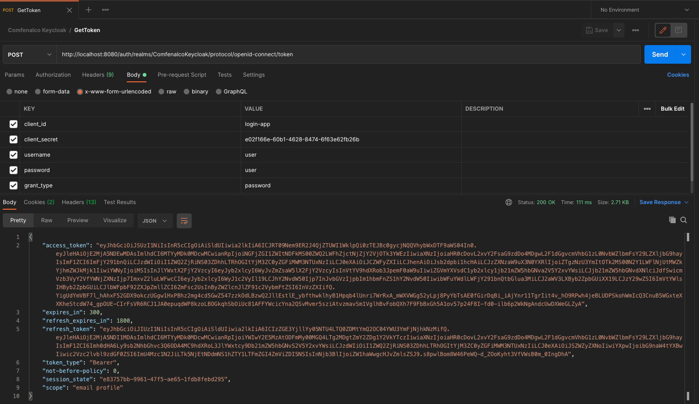

###### Spring Boot KeyCloak

**KeyCloak Setup**

This project was developed with KeyCloack 13.0.0 - Last version until today (13 May 2021)

please visit: https://www.keycloak.org/downloads and download "Wildfly" Option in ZIP format 

Once you download the server:

1. Unzip and run ./standalone
2. Open console with http://localhost:8080/auth
3. Create admin user and password
4. Login into keycloak console

**Create Realm**
1. Enter "Add realm" set RealmName (for this i use 'ComfenalcoKeycloak')

**Create Client**
1. On left corner click "Clients"
2. Click add new client
3. for this project it was "login-app"
4. Setup is its default, except for the Valid Redirect URIs field. 
   
This field should contain the application URL(s) that will use this client for authentication:
http://localhost:8081/*

**Create Role**
1. In the left corner select "Roles" then create new role
2. We created the role "comfenalcouser"

**User**
1. In the left corner select "Users"
2. Create new user, (for this example we use 'user') in "Credentials" tab uncheck "Temporary" and create a new password
3. In Role Mapping, add our created Role before

At this point the configuration its ready to go

**Get the token**
1. Make a POST request to URL
http://localhost:8080/auth/realms/ComfenalcoKeycloak/protocol/openid-connect/token
Check how after realms in the url we are calling our "ComfenalcoKeycloak"
   
2. Send the credentials we created before as the image below
3. In response, we'll get an access_token and a refresh_token.

4. The access token should be used in every request to a Keycloak-protected resource by simply placing it in the Authorization header

_headers: {
'Authorization': 'Bearer' + access_token
}_

5. Once the access token has expired, we can refresh it by sending a POST request to the same URL as above, but containing the refresh token instead of username and password:

_{
'client_id': 'your_client_id',
'refresh_token': refresh_token_from_previous_request,
'grant_type': 'refresh_token'
}_

Keycloak will respond to this with a new access_token and refresh_token.

**Setup and configuration for Spring Boot Application**

Configuration and setup for application.properties keycloak setup

